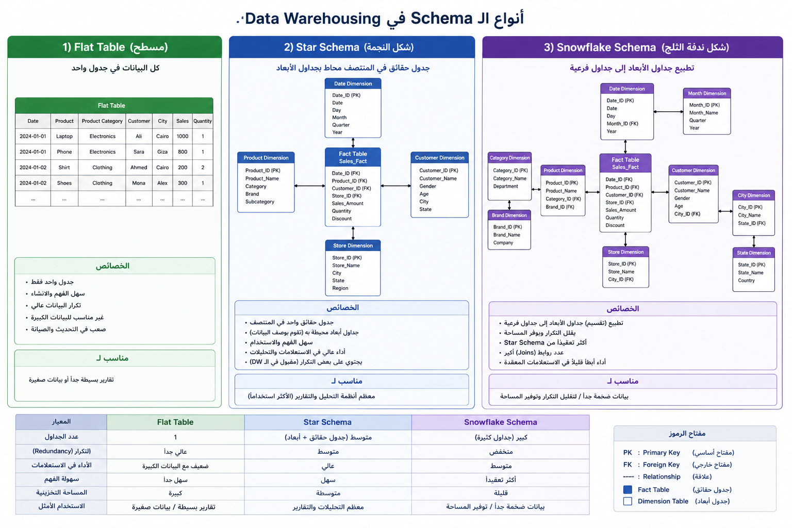

<h1 align="center" dir="rtl">تعلّم · Power BI</h1>

<h3 align="center" dir="rtl">كورس عربي شامل ومجاني لتعلّم Power BI من الأساسيات حتى مستوى نمذجة البيانات، DAX، النشر، الحوكمة، ومشاريع البورتفوليو.</h3>

[](https://ta3lam.github.io/Power-BI/)
[](https://ta3lam.github.io/Power-BI/)
[](https://ta3lam.github.io/Power-BI/)
[](LICENSE)
[](https://ta3lam.github.io/Power-BI/)

**[ابدأ التعلّم الآن](https://ta3lam.github.io/Power-BI/)**

---

<h2 dir="rtl">ما هذا المشروع؟</h2>

<p dir="rtl">
<strong>Ta3laM Power BI</strong> هو كورس عربي تفاعلي يعمل مباشرة من المتصفح لتعلّم <span dir="ltr">Microsoft Power BI</span> خطوة بخطوة، مع إمكانية التبديل إلى النسخة الإنجليزية من داخل الواجهة.
</p>

<p dir="rtl">
يركّز الكورس على بناء طريقة تفكير محلل <span dir="ltr">BI</span>، وليس مجرد شرح الأزرار. ستتعلم كيف تفهم البيانات، تنظفها، تبني نموذجًا موثوقًا، تكتب مقاييس <span dir="ltr">DAX</span> تخدم أسئلة العمل، ثم تنشر تقريرًا قابلًا للاستخدام في بيئة حقيقية.
</p>

<p dir="rtl">
لا تحتاج حسابًا أو اشتراكًا أو خطوات تثبيت معقدة. افتح الرابط وابدأ التعلّم.
</p>

---

## لمن هذا الكورس؟

هذا الكورس مناسب لـ:

- المبتدئين الذين يريدون مسارًا منظمًا من أساسيات البيانات حتى نشر التقارير.
- مستخدمي Excel أو SQL الذين يريدون الانتقال إلى Power BI وتحليل الأعمال.
- محللي البيانات الجدد الذين يحتاجون أساسًا أقوى في Power Query وDAX ونمذجة البيانات.
- أصحاب الأعمال والفرق التشغيلية الذين يريدون فهم KPIs والتقارير المبنية على القرارات.
- المدربين أو الفرق التي تبحث عن مسار عربي كامل لتعليم Power BI بشكل عملي.

---

## ماذا ستتعلم وتبني؟

بنهاية المسار، الهدف أن تكون قادرًا على:

- تصميم Data Model نظيف باستخدام Fact Tables وDimension Tables والعلاقات وDate Tables وBridge Tables.
- تنظيف وتحويل البيانات باستخدام Power Query وفهم متى يكون Query Folding مهمًا للأداء.
- كتابة DAX Measures لإجابة أسئلة عمل حقيقية، وليس فقط حفظ صيغ منفصلة.
- بناء Dashboards تشرح الأداء من خلال KPIs وFilters وBookmarks وDrillthrough وتصميم الموبايل.
- نشر التقارير والتفكير في RLS وGateway وRefresh والحوكمة وDeployment Pipelines.
- تنفيذ مشاريع عملية تصلح كبداية لبورتفوليو أو نقاش في مقابلة عمل أو عرض أمام عميل.

---

## معاينة بصرية

<p align="center">
  
  
</p>

<p align="center">
  
  
</p>

---

## لماذا بنيت هذا المشروع؟

كثير من محتوى Power BI يشرح الأداة كأنها مجموعة أزرار ورسومات. هذا المشروع يحاول تقديم الطريق الأعمق: التفكير في البيانات، بناء النموذج، فهم المقاييس، وضبط التقرير بحيث يخدم قرارًا واضحًا.

هذا المشروع جزء من رؤية **Ta3laM Tech** لتقديم تعليم عربي قوي في مجال البيانات، يجمع بين البساطة في الشرح والعمق المطلوب في العمل الاحترافي.

---

## المميزات

- **79 درسًا منظمًا** داخل 10 فصول متدرجة، من فهم البيانات حتى Microsoft Fabric وDeployment Pipelines.
- **327 سؤال كويز** موزعة على كل الدروس، مع حد نجاح 80%.
- **واجهة ثنائية اللغة**: المحتوى متاح بالعربية والإنجليزية من زر تغيير اللغة.
- **مسار عملي وليس نظريًا فقط**: Power Query وDAX وData Modeling وVisual Design وPublishing وGovernance.
- **فصل للذكاء الاصطناعي داخل Power BI**: مثل Key Influencers وQ&A وSmart Narrative وAnomaly Detection.
- **مكتبة KPIs حسب المجالات**: Finance وSales وInventory وHR وMarketing.
- **مشاريع Capstone**: مشاريع عملية متدرجة تساعدك على بناء بورتفوليو.
- **موقع Static بسيط**: يعمل من سيرفر محلي بدون build أو node_modules.
- **تخصيص الواجهة**: ألوان، كثافة عرض، Light/Dark Mode، وخلفية متحركة.
- **شهادة إتمام**: يتم توليدها PDF عند إنهاء كل الدروس.

---

## المنهج

| # | الفصل | عدد الدروس | أهم الموضوعات |
|---|-------|------------|---------------|
| 01 | البداية الحقيقية: افهم البيانات أولًا | 7 | OLTP vs OLAP، Star Schema، SCDs، Bridge Tables |
| 02 | هندسة البيانات وتحويلها | 6 | Power Query، M Language، Group By، Pivot/Unpivot، Query Folding |
| 03 | بناء نموذج البيانات | 5 | Relationships، Date Tables، Hierarchies، DirectQuery vs Import، Tabular Editor |
| 04 | DAX - Data Analysis Expressions | 15 | CALCULATE، Row/Filter Context، Iterators، Time Intelligence، M2M، Budget vs Actual |
| 05 | التصميم البصري والتقارير | 11 | Conditional Formatting، Bookmarks، Drillthrough، Mobile Design، AI Visuals |
| 06 | النشر والحوكمة | 5 | Workspaces، RLS، Gateway، Incremental Refresh |
| 07 | المستوى المتقدم والتحسين | 18 | Performance Tuning، Composite Models، Calculation Groups، Deployment Pipelines، Data Governance |
| 08 | الأتمتة والتكامل | 3 | Power Automate، Automated Refresh، Report Generation |
| 09 | مجالات KPIs | 5 | Finance، Sales، Inventory، HR، Marketing |
| 10 | المشاريع ودراسات الحالة | 4 | Pizza Place، Chess Games، Airbnb Intelligence، Portfolio Playbook |

---

## التقنيات المستخدمة

هذا المشروع **Static Site بدون build step**: لا يوجد framework ولا bundler ولا `node_modules`.

| الطبقة | التقنية |
|--------|---------|
| الهيكل | Vanilla HTML5 |
| التنسيق | CSS3 مع Design Tokens وCustom Properties |
| المنطق | Vanilla JavaScript ES6+ |
| المحتوى | الدروس داخل `js/lessons.js` |
| بيانات الكويز | `data/quizzes.json` ويتم تحميلها عبر `fetch()` |
| شهادة PDF | [jsPDF](https://github.com/parallax/jsPDF) من CDN، ويمكن توريده محليًا لو أردت Offline كامل |
| الاستضافة | GitHub Pages عبر GitHub Actions |
| الخطوط | Cairo وAlexandria وJetBrains Mono |

---

## التشغيل محليًا

يحتاج المشروع إلى Local Server لأن الكويزات يتم تحميلها باستخدام `fetch()`.

```bash
# Clone the repo
git clone https://github.com/ta3lam/Power-BI.git
cd Power-BI

# Start a local server (Python 3)
python -m http.server 8000

# Open in browser
# http://localhost:8000
```

لا تحتاج `npm install` ولا build step.

### فحص سريع قبل النشر

```bash
node --check js/shell.js && \
node --check js/quiz.js && \
node --check js/lessons.js && \
node --check js/curriculum.js && \
node -e "JSON.parse(require('fs').readFileSync('data/quizzes.json','utf8'))" && \
echo "All checks passed"
```

---

## هيكل المشروع

```text
Power-BI/
|-- index.html              # هيكل الواجهة الرئيسي
|-- css/
|   |-- shell.css           # Layout, sidebar, typography, design tokens
|   `-- style.css           # تنسيقات محتوى الدروس
|-- js/
|   |-- curriculum.js       # بيانات الفصول والدروس
|   |-- lessons.js          # محتوى كل الدروس بالعربية والإنجليزية
|   |-- shell.js            # التنقل، العرض، اللغة، وحالة المستخدم
|   `-- quiz.js             # الكويزات، الشهادة، وواجهة الاختبار
|-- data/
|   `-- quizzes.json        # 327 سؤالًا على كل الدروس
|-- images/                 # صور ولقطات وشرح بصري
|-- fonts/                  # خطوط محلية
`-- .github/
    `-- workflows/
        `-- static.yml      # النشر على GitHub Pages
```

---

## دعم اللغات

الكورس ثنائي اللغة. كل درس يحتوي على:

| الحقل | اللغة | الوصف |
|-------|------|-------|
| `title` / `lede` / `blocks` | العربية | المحتوى الأساسي |
| `en_title` / `en_lede` / `en_blocks` | الإنجليزية | الترجمة الكاملة |

زر تغيير اللغة داخل الواجهة يبدّل المحتوى مباشرة بدون إعادة تحميل الصفحة، ويتم حفظ تفضيل اللغة في `localStorage`.

---

## إضافة درس جديد

1. أضف بيانات الدرس في `js/curriculum.js`:

   ```js
   { id: "my-lesson", title: "عنوان عربي", en: "English Title", mins: 20, kind: "concept" }
   ```

2. أضف محتوى الدرس في `js/lessons.js` بنفس `id`:

   ```js
   "my-lesson": {
     eyebrow: "04 · 16 - عنوان",
     title: "عنوان",
     lede: "مقدمة قصيرة.",
     en_eyebrow: "04 · 16 - Title",
     en_title: "Title",
     en_lede: "Short intro.",
     blocks: [{ kind: "html", html: `<div>...Arabic HTML...</div>` }],
     en_blocks: [{ kind: "html", html: `<div>...English HTML...</div>` }],
   }
   ```

3. أضف أسئلة الكويز في `data/quizzes.json` باستخدام:

   ```json
   { "section": "my-lesson" }
   ```

4. شغّل أوامر الفحص قبل النشر.

---

## إحصائيات المشروع

| المؤشر | القيمة |
|--------|--------|
| عدد الدروس | 79 |
| عدد الفصول | 10 |
| عدد أسئلة الكويز | 327 |
| تغطية الكويز | 100% - كل الدروس لها أسئلة |
| اللغات | العربية والإنجليزية |
| متوسط الأسئلة لكل درس | 4.1 |
| درجة النجاح | 80% |

---

## الترخيص

هذا المشروع منشور تحت رخصة [MIT License](LICENSE)، ويمكن استخدامه ومشاركته والبناء عليه مع ذكر المصدر.

---

<div align="center">

صُنع بحب للمجتمع العربي المهتم بالبيانات

**[ta3lam.tech2024@gmail.com](mailto:ta3lam.tech2024@gmail.com)**

</div>
